# GenESysV - Genome Exploration System for Variants 

GenESysV is a fast, intuitive and scalable Genome Exploration Open Source Tool for Variants generated from high-throughput sequencing technologies

## GenESysV at a glance

GenESysV is built using Elasticsearch, a distributed RESTful search and analytics engine, and Django, a Python web framework. To use GenESysV, you need to install Elasticsearch, samtools, grabix, and the GenESysV Django app. 

## Installing Elasticsearch

We assume that GenESysV will be installed locally in an Ubuntu Linux environment with sudo privileges.

Install Elasticsearch into a directory of your choice (such as $HOME/Elasticsearch):

    wget https://artifacts.elastic.co/downloads/elasticsearch/elasticsearch-7.7.0-linux-x86_64.tar.gz
    tar xvf elasticsearch-7.7.0-linux-x86_64.tar.gz
    cd elasticsearch-7.7.0/ # We will refer this directory as elasticsearch root directory from now on
    
Next you will need to modify Elasticsearch options and update system-wide configurations for optimal Elasticsearch performance. 

Open file ``config/jvm.options`` and update the amount of memory Elasticsearch can allocate when it starts up. The amount of memory is set to half the system memory. For instance if your machine has 16 GB of RAM, set it to 8 GB. You will have to update two lines to allow JVM to allocate 8 GB. WARNING: Never allocate more than 32 GB. Change lines::

    -Xms2g
    -Xmx2g

to::

    -Xms8g
    -Xmx8g

and save and close file.

Next open file ``config/elasticsearch.yml`` and uncomment the following line:

    # Uncomment line to enable JVM memory allocation when Elasticsearch starts
    bootstrap.memory_lock: true
    
    # Uncomment line to specify the path for storing eleasticsearch data files
    path.data: /path/to/your/data
    
    # Uncomment line to specify the path for storing log files
    path.logs: /path/to/your/log/files

and save and close this file.  Setting ``bootstrap.memory_lock`` to ``true`` allocates RAM exclusively for Elasticsearch when it starts up. 

Next open ``/etc/sysctl.conf`` and add virtual memory limits:
   
    # At the end of file add line:
    vm.max_map_count=262144

and save and close the file. This setting increases the limit on mmap counts in order to avoid out of memory exceptions.

Next open ``/etc/security/limits.conf`` and add limits for Elasticsearch at the end of file:

    # At the end of file add lines:
    elasticsearch - nofile 65536
    elasticsearch soft memlock unlimited
    elasticsearch hard memlock unlimited

save and close the file. These limits allow Elasticsearch to open large number of files at once and allows it to allocate an unlimited amount of page/memory.

Next update the elasticsearch systemd configuration::
    
    systemctl edit elasticsearch

and add the lines:

    [Service]
    LimitMEMLOCK=infinity

save and close the file. This setting allows elasticsearch to allocate memory at startup.

Cd into your elasticsearch root directory and start elasticsearch and test the Elasticsearch installation by going to localhost address on port 9200::

    ./bin/elasticsearch
    
    curl 127.0.0.1:9200
you would expect to see the output like below:

    {
      "name" : "node-1",
      "cluster_name" : "elasticsearch",
      "cluster_uuid" : "Cf9Snb1gTSyI5W6S7N_kPQ",
      "version" : {
        "number" : "7.7.0",
        "build_flavor" : "default",
        "build_type" : "tar",
        "build_hash" : "81a1e9eda8e6183f5237786246f6dced26a10eaf",
        "build_date" : "2020-05-12T02:01:37.602180Z",
        "build_snapshot" : false,
        "lucene_version" : "8.5.1",
        "minimum_wire_compatibility_version" : "6.8.0",
        "minimum_index_compatibility_version" : "6.0.0-beta1"
      },
      "tagline" : "You Know, for Search"
    }

This completes the installation of Elasticsearch.

## Installing Samtools and Grabix 

Begin by installing required system packages::

    sudo apt-get install -y build-essential zlib1g-dev libncurses5-dev libncursesw5-dev libbz2-dev liblzma-dev git

Download samtools in /tmp::

    cd /tmp; wget https://github.com/samtools/samtools/releases/download/1.8/samtools-1.8.tar.bz2

Extract samtools::

    cd /tmp; tar -xjf samtools-1.8.tar.bz2;

Make and install samtools::

    cd /tmp/samtools-1.8; make; sudo make prefix=/usr/local/ install

Git clone grabix::
    
    cd /tmp; git clone https://github.com/arq5x/grabix.git

Make and and install grabix:

    cd /tmp/grabix; make; sudo cp grabix /usr/local/bin/;

## Installing GenESysV

GenESysV is built on top of Django. Django requires Python. The best way to install Django is to first create a virtualenv, and then install all the required python packages in the virtual environment using ``pip``. This setup ensures complete isolation of the GenESysV Python packages from the system-wide Python packages. Begin by installing python3 virtual environment, which is not installed by default::

    sudo apt-get install python3-venv

Clone the GenESysV repository in to your GenESysV instance:

    git clone https://github.com/ubccr/GenESysV.git

Change into GenESysV directory::

    cd genesysv

Install the python virtual environment:

    python3.6 -mvenv venv

Activate the newly created virtual environment:

    source venv/bin/activate

Install the python packages required for GenESysV, you can ignore the warning messages::
    
    pip install wheel    
    pip install -r requirements.txt

GenESysV uses memcached to speed up form loading. Install memcached:

    sudo apt-get install memcached

Create the database tables associated with the app and some default values by executing:

    python manage.py makemigrations core
    python manage.py migrate

Create a superuser who can log in to the admin site:

    python manage.py createsuperuser

Start the development server:

    python manage.py runserver 0.0.0.0:8000 # Put your IP Address and Port number here

Open a browser on your  machine and navigate to 127.0.0.1:8000 of your GenESysV instance and the GenESysV website should be running. You can stop the development server using ``CTRL + c`` inside the terminal that is ssh'd into the GenESysV instance. Note that the manage.py commands also have to be run inside the virtualenv.

### Quick Guide to Loading Data 

1. Single VCF for case only
    python utils/load_vcf.py --vcf <path_to_vcf_file> --tmp_dir /tmp --annot <annovar/vep> --hostname 127.0.0.1 --port 9200 --index <index_name> --study_name <study_name> --dataset_name <dataset_name> --num_cores <int> --assembly <hg19|hg38|GRCh37|GRCh38> --cleanup

2. Case and control VCF 
    python utils/load_vcf.py --vcf <path_to_case_vcf_file> --control_vcf <path_to_control_vcf_file> --tmp_dir /tmp --annot <annovar/vep> --hostname 127.0.0.1 --port 9200 --index <index_name> --study_name <study_name> --dataset_name <dataset_name> --num_cores <int> --assembly <hg19|hg38|GRCh37|GRCh38> --cleanup

3. Family based analysis
    python utils/load_vcf.py --vcf <path_to_case_vcf_file> --tmp_dir /tmp --annot <annovar/vep> --hostname 127.0.0.1 --port 9200 --index <index_name> --study_name <study_name> --dataset_name <dataset_name> --num_cores <int> --assembly <hg19|hg38|GRCh37|GRCh38> --ped <path_to_ped_file> --cleanup

*Please see next step for loading our test dataset as an example*
    

## Automatically Creating the UI

Basically GenESysV provides a web interface to make Elasticsearch queries. There are two ways to build the web interface. First, by using the provided load VCF script that automatically builds the web interface. Secondd, by logging in to the GenESysV admin site and building the web interface by clicking through it. This is quite flexible, but can become very tedious. Both ways will be described to make you familiar with how GenESysV works. They are complementary because in practice the web interface is initially built automatically and then modified and tweaked using the GenESysV admin site. 

We begin by automatically building the web interface using the GenESysV script. From the main GenESysV folder execute the following command to import sample data:

    python utils/load_vcf.py --vcf test_data/test_4families_annovar.vcf.gz --tmp_dir /tmp --annot annovar --hostname 127.0.0.1 --port 9200 --index test_4families_annovar --study_name test_4families_annovar --dataset_name test_4families_annovar --num_cores 4 --assembly hg19 --ped test_data/test_4families.ped --cleanup

The ``--vcf`` option specifies the path of the VCF file. The ``--tmp_dir`` option specifies the path of the temporary directory where temporary data will be saved. The ``annot`` option specifies the annotation to use. Currently, only two types of annotations are supported: ANNOVAR and VEP. The ``--hostname`` specifies the hostname of Elasticsearch. The ``--port`` option specifies the port Elasticsearch is running on. The ``--index`` option specifies the index name to use in Elasticsearch. The ``--study`` options specifies the study name to use in the web interface when selecting the study. The ``--dataset_name`` specifies the dataset name that will be displayed when selecting the dataset in the web interface. The ``--num_cores`` options specifies the number of parallel processes to use when parsing the VCF file. The ``--assembly hg19`` specifies the reference genome assembly version. The ``--ped`` option specifies the path to the associated PED file. Lastly, the ``--option`` specifies that the temporary files should be removed. For more options, please run the ``load_vcf.py`` file without any input parameters. Start the development server to start searching the data to get familiar with GenESysV:

    python manage.py runserver 0.0.0.0:8000

## Manually building the GenESysV Web User Interface (Optional, you can safely skip this section if you feel no need/desire to fine-tune your UI)

You should now be familiar with how GenESysV works. Before manually building the web interface, you need to become familiar with how its components are organized.

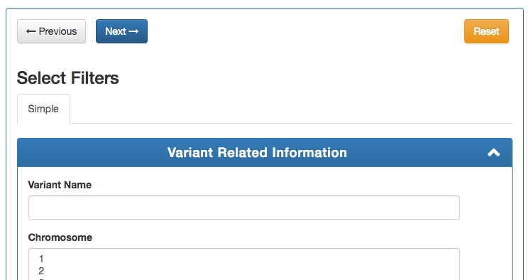

*Figure 1. Components that make up the web interface of GenESysV. Filter fields, example `Variant Name`, are put inside panels, example `Variant Related Information`. Panels are put inside a tab, example `Simple`. Tabs are associated with a dataset. Datasets are associated with a study.*

Figure 1 shows the components of the web interface. Fields used for filtering are put inside a panel. Panels are used to logically group filter fields. Panels can also contain sub-panels that in turn can contain filter fields. Sub-panels allow further grouping of filter fields within a panel. Figure 2 shows an example of a sub-panel. Panels themselves are put inside a tab. Tabs can be used to separate panels into different groups such as `basic` and `advanced` search fields.

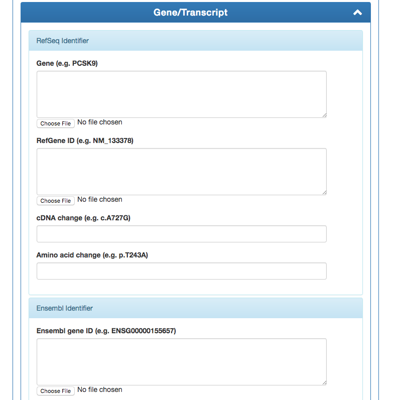

*Figure 2. Sub-panels that can be used to further organize filter fields within a panel.*

GenESysV allows a user to select which fields they want to display in the search results. This allows a user to include more, less, or different fields in the search results than the ones used for searching. The result fields are called `attributes` – we are selecting the attributes of the filtered data that we want to see. Attribute fields are organized in a similar manner to filter fields. Attribute fields are placed inside panels to logically group them. Panels can contain sub-panels. Panels are placed inside tabs. Both the filter and attribute tabs are associated with a dataset. Datasets are associated with a study. Finally, a study can contain multiple datasets.

Adding study, dataset, and search options
--------------------------------------------
Start by loading a test data dataset from the main GenESysV folder:

    # from the main GenESysV folder
    source activate venv/bin/activate
    python manage.py import_test_data

To begin building the web interface, log in to the admin site by going to http://172.0.0.1/admin. Make sure that the development server is running. Use the username and password that you used to create the ``superuser``. First we will add a new study by clicking the ``+ Add`` button next to ``Studies``, see Figure 3. In the ``Add Study`` page, specify a name for the study. You can also add a description, but this is optional as indicated by the non-bold text label. Click the save button to create the study. Click on the `home` link in the breadcrumb navigation to return to the admin home page.

*Figure 3. Adding a study page with the '+ Add' button. This page is used to add and update a study.*

Next we will add a dataset that is associated with the study that we just added. Click ``+ Add`` button next to ``Datasets``. Select the study that you just added from the drop down menu, which should be ``test_data``. Select ``complex`` for analysis type. Fill in the dataset name and description field. Next fill in ``Es index name``, ``Es type name``, ``Es host``, and ``Es port``, which should be `test_data`, `test_data`, `127.0.0.1`, and 9200, respectively. Check the ``is_public`` field to make the test dataset accessible by all. The allowed groups field allows you to manage which groups can access the dataset if you want to restrict access to the dataset. To restrict a dataset based on the user, add the user to a group and add the group to ``allowed_groups`` field. Figure add_dataset_page_ shows the add dataset page with the fields filled. Click on the `home` link in the breadcrumb navigation to return to the admin home page.

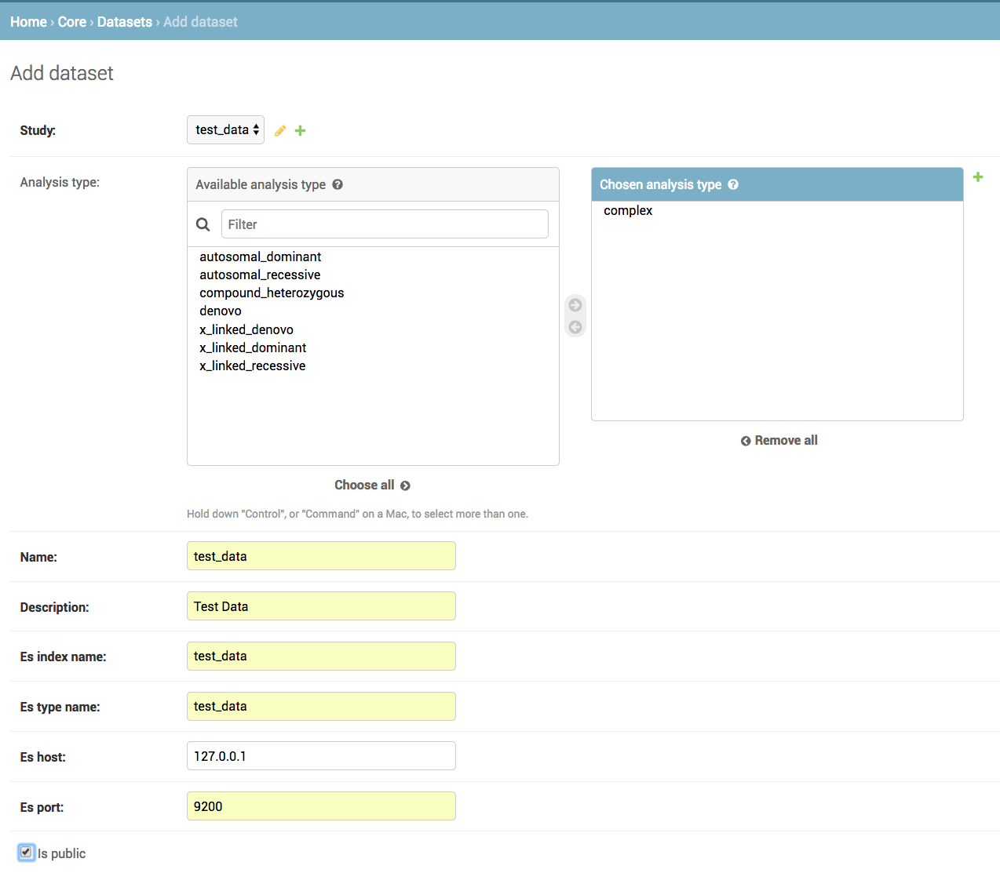
 
*Figure 4. Adding a dataset page. This page is used to add and update a dataset.*

Next we need to add search options for the dataset. A dataset can contain millions of documents. Displaying so many results can cause rendering issues, so we use search options to limit the number of results that are shown to 400 documents. If you want to fetch all the results, you can download them from the search results page. To add the default search options, click the ``+ Add`` button next to ``Search options``. Choose the dataset you just added and leave the other values to the default and click SAVE. Figure 5 shows the page for adding searching options for a dataset.

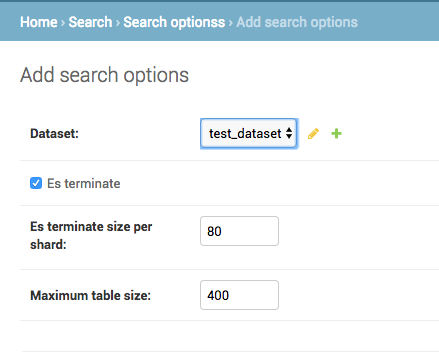
  
 *Figure 5. The Add search options page. This page is used to add and update the search options associated with a dataset. Search options limit the number of results returned matching the search criteria.*

Adding filter and attribute panels and tabs
-----------------------------------------------
Before we add filter and attribute fields, we need to first add panels, and maybe sub-panels, and tabs to contain the panels. Click ``+Add`` button next to ``Filter panels``. Select ``test_data`` for dataset. Enter ``Variant Related Information`` for name and click save to create the panel. Figure 6 shows the page for adding a filter panel. Repeat these steps and add two more panels called ``Functional Consequence`` and ``Sample Related Information``. 

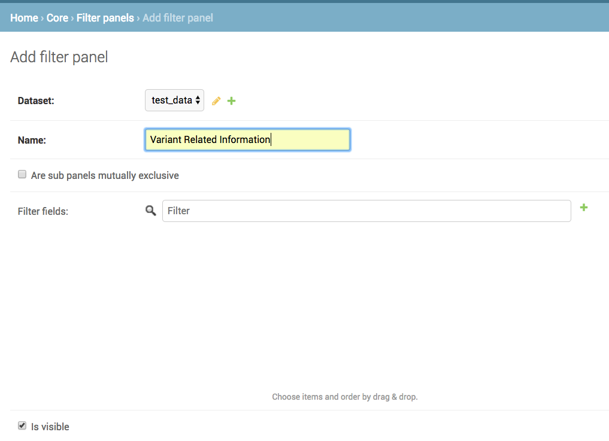
  
*Figure 6. Adding a filter variant panel.*

We will also add a sub-panel to demonstrate how sub-panels work. Click ``+Add`` button next to ``Filter sub panels``. Sub-panels have to be associated with a panel because the former are placed inside the later. So when creating a sub-panel, you have to first select the dataset and specify the name of the panel and click save and continue editing. Once the panel has been saved, the refreshed page for sub-panel will now show a drop down list for panels in which the sub-panel can be placed. Figure 7 shows add sub-panel page before saving and figure 8 shows the add sub-panel page after the initial save. Note that the panel drop down is now populated.  

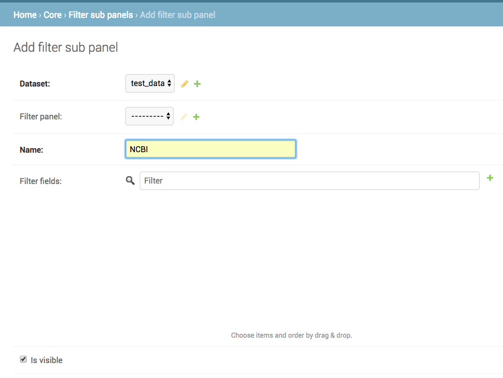
 
*Figure 7. Adding a filter sub-panel*

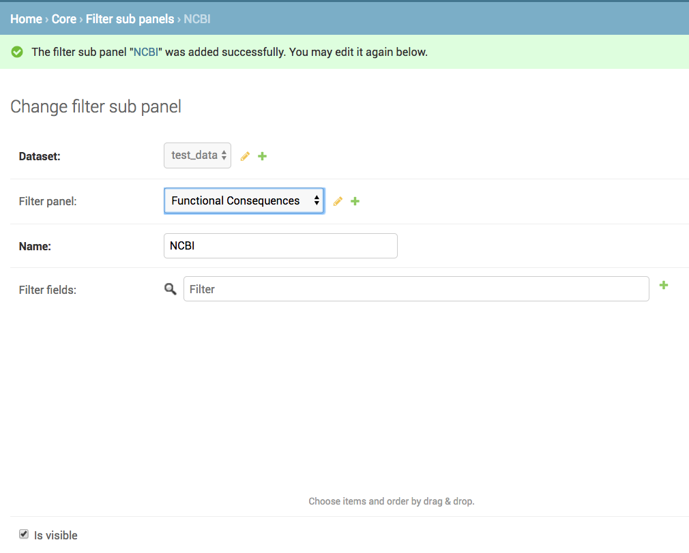

*Figure 8. Adding a filter sub-panel page after saving. Note that the panel dropdown is now populated.*

Now we will add a filter tab that will contain all the filter panels. Click the ``+Add`` button next to  ``Filter Tab``. Select 'test_data' for dataset and name the tab 'Basic'. Check all three filter panels that we had created. Figure 9 shows an add filter tab page. 

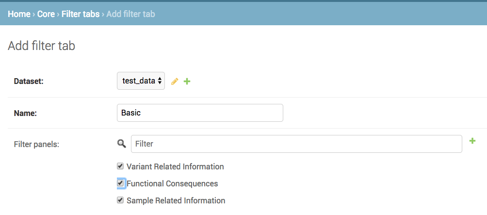

*Figure 9. Adding a filter tab page.*

Repeat the steps for creating a panel, sub-panel and tab for attributes, see figures 10, 11, and 12.

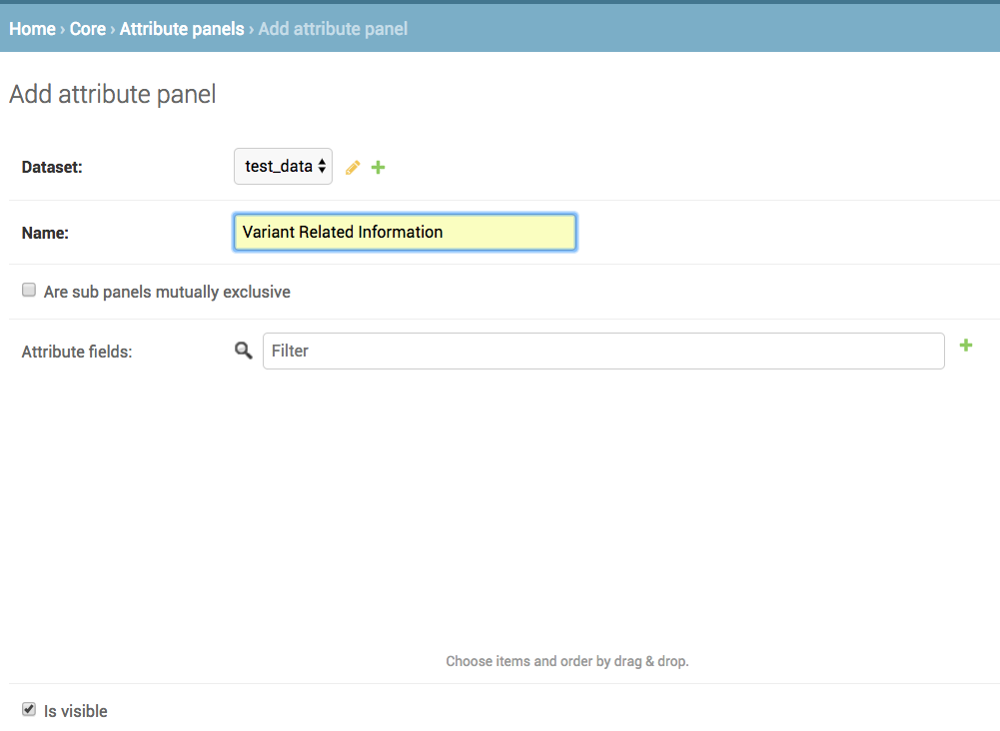
 

*Figure 10. Adding attribute panel page.*

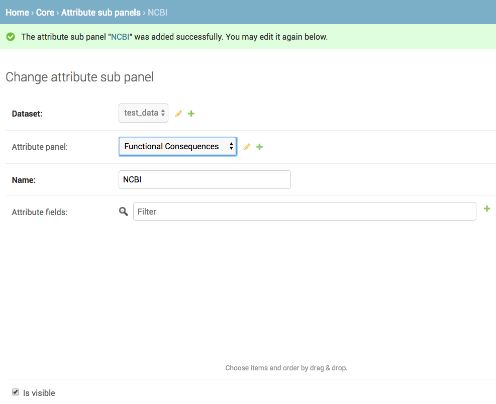

*Figure 11. Adding an attribute sub-panel page. Note that you have to save the sub-panel before you can select the panel to place the sub-panel inside.*

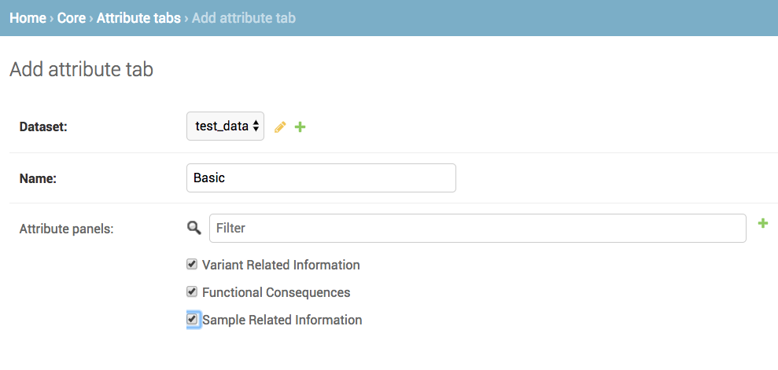

*Figure 12. Adding attribute tab page.*

Managing Filters
---------------------------
Now we are ready to add filter fields. Currently GenESysV supports three types of forms for filter fields: ``CharField``, ``ChoiceField`` and ``MultipleChoiceField``. The ``CharField`` can use three types of form widget: ``TextInput``, ``TextArea``, and ``UploadField``. The ``TextInput`` widget is a simple text input box that allows the user to search for a single term. The ``TextArea`` is also a text input box but allows rows of terms. Finally, the ``UploadField`` uses the ``TextArea`` widget but with an extra upload button that allows users to select a file from which to populate the ``TextArea`` widget. The ``TextArea`` and ``UploadField`` widgets allow users to search for multiple terms. The ``ChoiceField`` uses the ``Select`` widget
that renders a single-select drop down menu for selecting a single term to search for from a list of choices. And the ``MultipleChoiceField`` field uses a ``SelectMultiple`` widget that renders a multi-select field to allow users to select multiple terms to search for from a list of choices.

Click ``+ Add`` button next to the ``Filter Fields``. Select `test_data` for dataset. Enter `Variant` for display text. Select `CharField` for form type. Select `TextInput` for widget type. Enter `Variant` for Es name. Select `keyword` for es data type. Select `filter_term` for es filter type. Select `Variant Related Information` for place in panel.   Click save to create the field. Figure 13 shows an example page for adding a filter field.

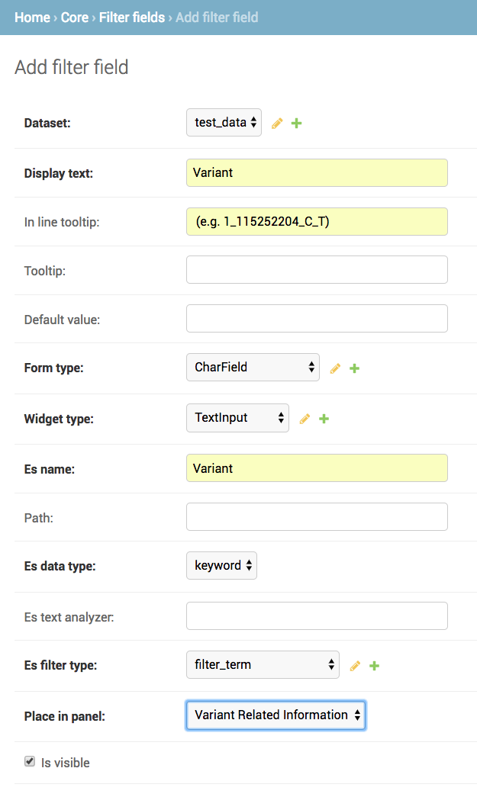

*Figure 13. Adding a filter field page.*

The ``Display name`` field allows the user to specify the name that will be displayed as the text label for the filter field. This name can be different from the name in Elasticsearch. The ``In line tooltip`` field allows the user to display a tooltip next to the display name. The ``Tooltip`` field allows the user to specify
a hover-over tooltip associated with the filter field. This can be used to guide the user and explain the filter field. The ``Form type`` is one of the three form types that GenESysV currently supports. The ``Widget type`` is one of the five types of Widget that GenESysV currently supports. The ``Es name`` is the name of field that will be searched in Elasticsearch. The ``path`` field specifies the path of the filter field if it is a nested field. The ``Es data type`` field specifies what Elasticsearch data type the field is such as float, integer, keyword, or text. ``Es text analyzer`` specifics the Elasticsearch text analyzer to use if the ``Es data type`` is set to text. See https://www.elastic.co/guide/en/elasticsearch/reference/current/analysis-analyzers.html for details about the various analyzers. The ``Es filter type`` field allows the user to specify which Elasticsearch type query to use. The ``Place in panel`` is used internally by GenESysV for properly displaying the available filter fields for a given dataset. It should be the ``display_name`` of the panel the filter field is associated with. Finally, the ``Is visible`` field is  used to show or hide filter fields. Table 1 explains the query types. Not all queries that Elasticsearch can do are currently supported by GenESysV.

|Es filter type    |           When to use |
| --------------------------|-------------------------------------------------------------------------------------------- |
| filter_term               |   To find documents that contain the exact term specified  |
| filter_terms              |   To find documents that contain at least one of the exact terms specified  |
| nested_filter_term        |   To find documents that contain the exact term specified in a nested field |
| nested_filter_terms       |   To find documents that contain at least one of the terms specified in a nested field |
| filter_range_gte          |   To find documents with values greater than or equal to specified  |
| filter_range_gt           |   To find documents with values greater than specified  |
| filter_range_lte          |   To find documents with values less than or equal to specified  |
| filter_range_lt           |   To find documents with values less than specified  |
| nested_filter_range_gte   |   To find documents with values greater than or equal to specified in a nested field  |
| filter_exists             |   To find documents in which the field specified exists  |
| must_not_exists           |   To find documents in which the field specified does not exist  |
| nested_filter_exists      |   To find documents in which the nested field specified exists  |

*TAble 1. Elasticsearch filter types.*

Use the information from figure 14 to add the remaining filter fields.  

 
*Figure 14. All the filter fields*

``ChoiceField`` and ``MultipleChoiceField`` require that you specify choices for them. You should have added three ``MultipleChoiceField`` -- Sample_GT, Sample_ID, and ExonicFunc_refGene. These fields need choices. Click the ``+ Add`` next to the ``Filter Choice Fields``. Click the search (magnifying glass) icon to open a another window from which you will choose ``ExonicFunc_refGene (test-dataset)`` for filter field by clicking the colored display text. This will automatically put the ID of the chosen field in the filter field. This unique number identifies filter fields and can be different based on which order you added the filter fields. Enter ``stoploss`` for value and click save. Figure add_filter_field_choice_ shows an example add filter field choice page.

 
 
*Figure 15. Adding filter choice field page. Single and multiple select choice fields require that you specify the choices. This page is used to add choices.*

*Figure 16. Screenshot showing the admin site after adding all the filter field choice options.*

Finally, you need to edit panels or sub-panels to add the filter fields to panels. Although you have already specified place in panel for each filter field, you still need to edit the panels or sub-panels to add the filters in the panel or sub-panel. Figure all_filter_fields_to_panel_ shows the change filter panel page for the ``Variant Related Information`` with all the filter fields selected. You can rearrange the order of the filter fields by dragging and dropping. 

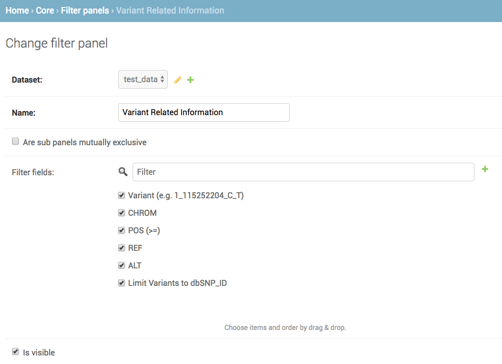

*Figure 17. Selecting and ordering the filter fields in a panel.*

This completes the steps needed to manage the filters. To recap, there are nine steps for building the filter UI:

1. Add study
2. Add dataset
3. Add search options
4. Add panel
5. Add sub-panel if needed 
6. Add tab
7. Add filter fields
8. Add filter field choices if necessary
9. Associate filter fields to panels or sub-panels. 

Managing Attributes
-----------------------------
Start by adding three attribute panels and one sub-panel, see figures 18 and 19.

*Figure 18. Adding attributes panels.*

*Figure 19. Adding attribute sub-panels.*

Then add an attribute tab to contain the three panels. 

Next we will add a variant attribute. Click ``+Add`` next to ``Attribute fields``. Select `test_data` for dataset. Enter `Variant` for display text. Enter `Variant` for Es name. Select `Variant Related Information` for place in panel. Check `Is link field`. The last option makes the variant field a link field that takes you to the variant detail page. 

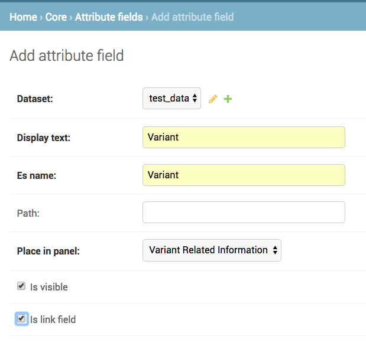

*Figure 20. Adding a attribute filter page for variant.*

Use figure 21 to add the other attribute fields. 

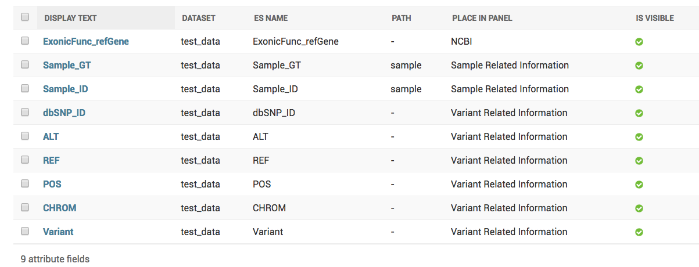

*Figure 21. all the attribute fields that should be added.*

Finally, add the attributes fields to the appropriate panels and sub-panels. 

The steps for building the attribute fields GUI, assuming that the study, dataset, and the search options have been added, are:

1. Add panels
2. Add sub-panels
3. Add tab
4. Add attribute fields
5. Associate attribute fields to panels or sub-panels. 

For documentation of the first release using Elasticsearch-3.6.1, please refer to [this link](docs/source/index.rst)

## License: 
BSD 3-Clause "New" or "Revised" License
